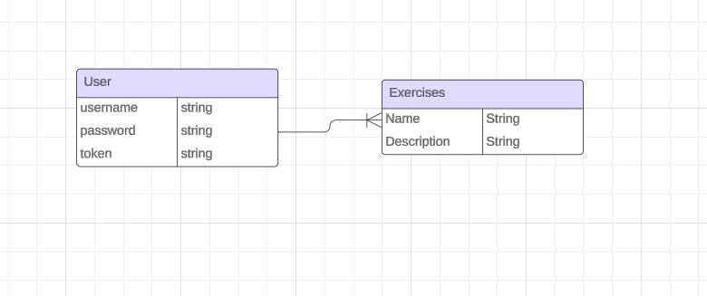
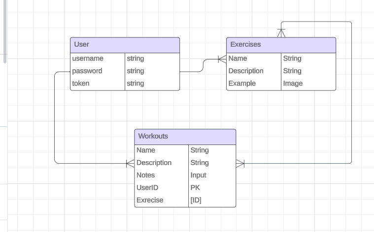

# MongoMuscles API 

#### Backend server for the MongoMuscles app, with auth and mongoose relationships etc.


It will be utilized by the **MongoMusclesb** client application: https://main--mongomuscles.netlify.app/

## Getting Started

Deployed API URL: https://mongomusclesapi.fly.dev/

## ERD



## ICEBOX ERD




## Entities 

```js
User is comprised of the following:

		email: {
			type: String,
			required: true,
			unique: true,
		},
		hashedPassword: {
			type: String,
			required: true,
		},
		token: String,
```

```js
Exercise is comprised of the following:

    username: { 
        type: String, 
        required: true 
        },
    description: { 
        type: String, 
        required: true 
        },

```


## Routes 

### AUTH Routes

| Verb   | URI Pattern            | Controller#Action |
|--------|------------------------|-------------------|
| POST   | `/sign-up`             | `users#signup`    |
| POST   | `/sign-in`             | `users#signin`    |
| PATCH  | `/change-password/` | `users#changepw`  |
| DELETE | `/sign-out/`        | `users#signout`   |


### Exercise Routes

| Verb   | URI Pattern            | Controller#Action |
|--------|------------------------|-------------------|
| GET   | `/exercises`             | `exercises#index`    |
| GET   | `/exercises/:id`             | `exercises#show`    |
| POST   | `/exercises`             | `exercises#create`    |
| POST  | `/exercises` | `exercises#update`  |
| DELETE | `/exercises/:id`         | `exercises#delete`   |

